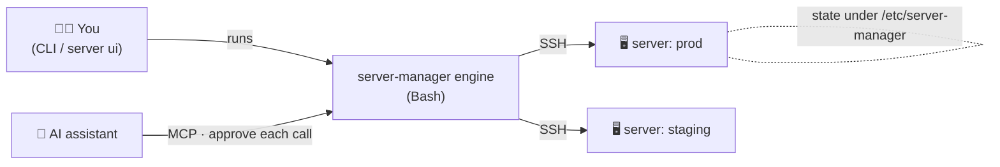

# server-manager

[](LICENSE)
[](#requirements)
[](#requirements)
[](docs/mcp.md)
[](https://github.com/regnatech/server-manager/actions/workflows/ci.yml)

**Ship to a Linux server the way you wish you could — one wizard, then
`server update`.** Zero‑config deploys, rollbacks, TLS, databases, queues and a
security audit, over plain SSH with no agent on the box. And your AI can drive
all of it through [MCP](#mcp-server-ai-access).

```bash
server connect prod root@203.0.113.10     # register a server (auto-installs deps)
server add     app.com /var/www/app/public # wizard: detect framework, nginx, DB, TLS
server update  app.com                      # zero-downtime deploy (clones on first run)
```

…and that's a production Laravel/Symfony/Node site: built, migrated,
TLS‑secured, with the scheduler and queue workers (Horizon) already running.

> Pure Bash over SSH — runs anywhere with `bash` + `ssh`. No agent to install,
> no config files to hand‑edit. The server is the source of truth.

---

## Why it actually helps

The boring, error‑prone parts of running a server — provisioning, deploy order,
TLS, migrations, workers, rollbacks — are exactly where a small mistake costs you
an outage at 2am. server‑manager turns each into one intentful command, and
makes the safe thing the default.

<details>
<summary><b>🚀 One command instead of a runbook</b></summary>

<br>`server update` runs the whole sequence for you, in the right order, with a
backup first and the site brought back online automatically if a step fails:

```
backup → maintenance mode → git pull (clone on first deploy) → composer →
frontend build → migrations → cache → restart → health check → timed report
```

No more half‑remembered SSH sessions and `cd /var/www && git pull && …`.
</details>

<details>
<summary><b>🩹 Self‑healing deploys</b></summary>

<br>When a build step fails because something's missing, it **diagnoses the
error and fixes exactly that**, then retries — instead of dumping a stack trace
on you:

```
✖ Installing Composer dependencies   (requires ext-gd … missing)
✔ Auto-fix: installing PHP extension gd
✔ Installing Composer dependencies (retry)
```

Missing PHP extension, Composer/Node/pnpm, unzip, git, Composer OOM — handled.
</details>

<details>
<summary><b>⚙️ Production‑ready by default</b></summary>

<br>For Laravel/Symfony it doesn't just copy files — it makes the app *run* in
production: enables the **scheduler**, sets up **queue workers** (installs and
starts **Horizon** for Laravel; a **Messenger** consumer for Symfony), runs
**migrations**, warms caches, and sizes the worker pool to the server's CPU/RAM
(you can override). Private repos work via an auto‑provisioned **deploy key**.
</details>

<details>
<summary><b>🖥️ A real control panel in your terminal</b></summary>

<br>`server ui` is a full‑screen TUI: every site with framework/TLS/last‑deploy,
and per‑site actions — deploy, logs, rollback, TLS, audit, **database
import/export**, a **file manager** (browse + edit remote files), **scale
workers**, toggle the scheduler, open a shell. No browser, no Electron.
</details>

<details>
<summary><b>🤖 Your AI can operate it — safely</b></summary>

<br>`server mcp` exposes the **whole CLI** to an AI assistant over
[MCP](#mcp-server-ai-access). Ask Claude *"deploy app.com and show me the logs if
it fails"* and it can — with **your approval on every action**, read‑only mode
available, and secrets kept off by default.
</details>

<details>
<summary><b>🔒 Safe by construction</b></summary>

<br>Every deploy is backed up and **instantly reversible** (`server rollback`).
A built‑in **security audit** flags root SSH login, open firewalls, exposed
`.env`, missing HTTPS and more — each with a one‑click fix. State lives on the
server, so the tool is stateless and disposable.
</details>

---

## Screenshots

`server ui` is a full‑screen terminal control panel. (Shown as plain text; in a
real terminal it's colour‑highlighted with a moving selection bar.)

**Dashboard — every site at a glance, with live status**

```text
 server-manager — terminal control panel

Servers: 2    default: prod

SITES (3)
  DOMAIN                   FRAMEWORK   TLS  LAST DEPLOY            SERVER
> clicketta.net            Laravel     yes  20260630-1547 (ok)     prod
  shop.example.com         Symfony     yes  20260628-0902 (ok)     prod
  blog.acme.io             Static Webs no   never                  staging

↑/↓ move · enter open · a add · r refresh · ? help · q quit
```

<details>
<summary><b>Per‑site menu — deploy, workers, scheduler, database, files…</b></summary>

```text
 clicketta.net on prod

  Framework  Laravel         TLS  yes
  Scheduler  on              Worker  Horizon (5)

Actions
  > Deploy (update)
    View logs
    Roll back
    Renew TLS certificate
    Security audit
    Show .env
    Import database
    Export database (backup)
    Upload file / directory
    File manager
    Scale workers
    Toggle scheduler
    Open a shell
    Back

↑/↓ move · enter run · esc back · q quit
```
</details>

<details>
<summary><b>File manager — browse and edit remote files</b></summary>

```text
 Files clicketta.net
  /var/www/clicketta_net

  ../
  app/
  config/
  public/
> .env                                              512 B
  artisan                                          1.6 KB
  composer.json                                    2.1 KB
  storage@

↑/↓ move · enter open · ← up · n new · m rename · d del · g get · r refresh · esc back
```
</details>

---

## Table of contents

- [Why it actually helps](#why-it-actually-helps)
- [Screenshots](#screenshots)
- [Features](#features)
- [How it works](#how-it-works)
- [Requirements](#requirements)
- [Install](#install)
- [Quick start](#quick-start)
- [Command reference](#command-reference)
- [Examples](#examples)
- [Self‑healing deploys](#self-healing-deploys)
- [Security audit](#security-audit)
- [MCP server (AI access)](#mcp-server-ai-access)
- [The JSON protocol](#the-json-protocol)
- [Where things live](#where-things-live)
- [Development](#development)
- [License](#license)

---

## Features

- **Wizard (`server add`)** — probes the server, auto‑detects the framework
  (Laravel, Symfony, Statamic, WordPress, static, Node/Next/Nuxt, reverse
  proxy), and asks only what it can't infer. If the site is **already deployed
  and serving** (a live nginx vhost or a registered config), it offers to
  **adopt** it — register its config and keep the existing vhost, no deploy —
  instead of provisioning over the top.
- **Intelligent deploy (`server update`)** — backup → maintenance mode →
  `git pull` (clones on first deploy) → Composer → frontend build → migrate →
  cache rebuild → restart → health check, with a timed report. Brings the site
  back online automatically if a step fails.
- **Self‑healing deploys** — diagnoses a failed build step and applies a
  **targeted** fix, then retries: a missing PHP extension installs exactly
  `php<ver>-<ext>`, a missing Composer/Node/package‑manager is provisioned, etc.
- **Security audit (`server audit`)** — analyses the server's posture and offers
  **one‑click fixes** for the issues it finds.
- **Rollback** — restores code, database, `.env`, dependencies and caches from
  the pre‑deploy snapshot.
- **Provisioning** — installs PHP‑FPM (+ common extensions, Composer), MariaDB,
  the Node toolchain, supervisor workers and the Laravel scheduler as needed.
- **TLS** — Let's Encrypt via certbot, on by default in the wizard.
- **Files & config** — push files/dirs (`server upload`) and edit the remote
  `.env` in place (`server env`) without leaving the CLI.

---

## How it works



The engine runs locally and SSHes out to each managed server — no agent on the
box. **State lives on each server** under `/etc/server-manager/` (the source of
truth), so the tool itself is stateless and disposable. A single box can also
manage **itself** (`server connect-self`), and an AI assistant can drive the
same engine through [MCP](#mcp-server-ai-access) with per‑call approval.

---

## Requirements

**Control side (where you run `server`):** `bash` ≥ 3.2 and an OpenSSH client.
On Linux/macOS these are built in; on **Windows** use Git Bash or WSL (see
[Install](#install)). Password auth additionally needs `sshpass`.

**Managed server:** SSH access as root **or** a sudo user with passwordless
sudo (sudo can't prompt over a non‑interactive channel; `server connect` checks
this and tells you if it's missing). Debian/Ubuntu (apt) is the primary target;
RHEL‑family (dnf/yum) is supported on a best‑effort basis.

---

## Install

**Homebrew (macOS / Linux)**

```bash
brew install regnatech/tap/server-manager
server help
```

**From source (macOS / Linux)**

```bash
git clone https://github.com/regnatech/server-manager.git
cd server-manager
./install.sh                 # symlinks ./bin/server onto your PATH
# or: make install
server help
```

**Windows**

> ⚠️ **WSL is required** (the engine is Bash + OpenSSH). Install it once in an
> admin PowerShell, then reopen your terminal:
> ```powershell
> wsl --install
> ```
> Git Bash also works as an alternative.

A launcher (`bin\server.cmd` / `bin\server.ps1`) finds the Bash backend for you,
so `server …` works from `cmd` or PowerShell just like on Linux:

```powershell
git clone https://github.com/regnatech/server-manager.git
cd server-manager
./install.ps1                # adds bin\ to your PATH (finds Git Bash / WSL)
# open a new terminal:
server help
```

`.gitattributes` keeps the shell scripts LF on Windows checkouts. Password auth
additionally needs `sshpass` (available in WSL; in Git Bash prefer key auth).

## Quick start

```bash
# 1. Register a server (probes SSH + sudo). Add -p to use a password.
server connect prod deploy@203.0.113.10
server connect prod deploy@203.0.113.10:22 -i ~/.ssh/id_ed25519
#    …or manage the box you're on:
server connect-self

# 2. Add a site — the wizard discovers and provisions it.
server add clicketta.site /var/www/clicketta/public

# 3. Deploy (clones the repo on the first run).
server update clicketta.site

# 4. Something broke? Roll back the last deploy.
server rollback clicketta.site
```

### Command reference

| Command | Description |
|---|---|
| `server ui` | Full‑screen terminal control panel — manage everything interactively. |
| `server mcp` | Run the MCP server so AI assistants can drive the CLI ([docs](docs/mcp.md)). |
| `server connect <name> user@host[:port] [-i key] [-p]` | Register a server (probes SSH + sudo). |
| `server connect-self [name]` | Register the current machine as a managed target (self‑host). |
| `server use <name>` | Set the default server. |
| `server servers` | List registered servers. |
| `server add [domain] [root]` | Wizard: discover, configure, provision (nginx, DB, TLS) — or **adopt** a site that's already deployed and serving. |
| `server update <site>` | Intelligent, near‑zero‑downtime deploy with health check. |
| `server rollback <site> [git-ref]` | Revert the last deploy (code + data) or to a ref. |
| `server release <init\|deploy\|list\|rollback\|prune> <site>` | Atomic, symlink‑switched releases. |
| `server ssl <site>` | Issue or renew the Let's Encrypt certificate. |
| `server list` | List managed sites, frameworks, TLS and last deploy. |
| `server import <domain> <root>` | Adopt an already‑deployed site, no deploy (also offered automatically by `server add`). |
| `server upload <site> <local> <remote>` | Copy a local file/dir to the site's server. |
| `server env <site> [show\|get\|set\|unset\|pull\|push\|edit]` | Manage the remote `.env`. |
| `server logs <site> [type]` | Tail remote logs (`nginx`\|`php`\|`laravel`\|`queue`). |
| `server php <site> [args…]` | Run artisan/php, or show/switch the PHP version. |
| `server db import\|export [site] [file]` | Import/export a site's database. |
| `server scheduler <site> [status\|on\|off]` | Laravel scheduler cron. |
| `server worker <site> [status\|setup\|restart\|logs\|remove]` | Background workers. |
| `server cron <site> [list\|add "<sched>" "<cmd>"\|remove <n>]` | Custom cron jobs. |
| `server git <action> <site> …` | Git ops, incl. `deploy-key` (set up an SSH deploy key). |
| `server audit [site]` | Security audit: findings + one‑click fixes. |
| `server audit fix <id> [site]` | Apply a single audit remediation. |
| `server metrics` · `server uptime [site\|--all]` | Health snapshot · HTTP health check. |
| `server config <list\|get\|set>` · `server notify …` | Global settings · notifications. |

**Global options:** `--server <name>` (target a specific server), `-y`/`--yes`
(non‑interactive), `--no-color`, `-h`/`--help`, `-V`/`--version`.

### Examples

```bash
# Target a non-default server for a one-off command
server update shop.example.com --server prod

# Tail Laravel logs
server logs clicketta.site laravel

# Run an artisan command on the remote
server php clicketta.site artisan migrate --force

# Database
server db export clicketta.site ./backup.sql.gz
server db import  clicketta.site ./seed.sql.gz

# Push a file and edit the remote .env
server upload clicketta.site ./service_account.json storage/service_account.json
server env    clicketta.site set APP_DEBUG false

# Adopt a site that's already deployed and serving (register it, keep its
# vhost, no deploy). `server add` offers this automatically when it detects
# an existing site; `server import` is the explicit form.
server import clicketta.site /var/www/clicketta/public

# Private repo over SSH: provision a deploy key, then deploy
server git deploy-key clicketta.site      # prints a key to add on GitHub
server update clicketta.site

# Scheduler & workers
server scheduler clicketta.site on
server worker    clicketta.site setup

# Custom cron
server cron clicketta.site add "0 3 * * *" "php artisan backup:run"
server cron clicketta.site list
```

### Self‑healing deploys

When a build step fails because something is missing, the deploy **diagnoses the
error and applies a targeted fix**, then retries the step once instead of
aborting:

```
✖ Installing Composer dependencies      (laravel/framework requires ext-gd … missing)
• diagnosing the error…
✔ Auto-fix: installing PHP extension gd
✔ Installing Composer dependencies (retry)
```

Covered cases include: missing PHP extension (`ext-*` → installs exactly that
extension), missing `composer` / `unzip` / `git`, missing Node.js or the
project's package manager (npm/pnpm/yarn/bun), and Composer OOM (the limit is
disabled pre‑emptively). Disk‑full (`ENOSPC`) is reported rather than retried.

### Security audit

```bash
server audit                 # audit the default server
server audit prod-site.com   # include site-specific checks
server audit fix firewall    # apply one fix by id
```

Checks include: root SSH login, SSH password auth, firewall (ufw), fail2ban,
automatic security updates, pending security updates, world‑readable `.env`,
`.env` exposed over HTTP, and missing HTTPS. Each finding reports a severity and
a recommendation; the fixable ones can be remediated with a single command.

---

## MCP server (AI access)

`server mcp` runs a [Model Context Protocol](https://modelcontextprotocol.io)
server so an AI assistant (Claude Desktop, Claude Code, …) can drive the **whole
CLI** — list/deploy/rollback sites, read logs/metrics/audits, manage TLS,
workers, cron, the `.env`, files, git, databases, and more. It's a thin python3
wrapper (stdlib only) around `server --json`, speaking JSON-RPC over stdio.

**Requirements:** `python3` on the machine that runs the CLI.

**Add it to Claude Code**

```bash
# Writes enabled — you approve each action in the client (recommended):
claude mcp add server-manager -- server mcp

# Observe-only (no mutating tools):
claude mcp add server-manager --env SM_MCP_READONLY=1 -- server mcp
```

**Add it to Claude Desktop** — in `claude_desktop_config.json`:

```jsonc
{
  "mcpServers": {
    "server-manager": {
      "command": "server",
      "args": ["mcp"]
      // "env": { "SM_MCP_READONLY": "1" }       // observe-only
      // "env": { "SM_MCP_ALLOW_SECRETS": "1" }  // allow reading .env values
    }
  }
}
```

(If `server` isn't on the client's PATH, use the absolute path to `bin/server`.)

**Permissions** — write tools are available by default and the MCP client asks
you to approve each call. `SM_MCP_READONLY=1` disables all mutating tools;
reading `.env` secrets is opt‑in via `SM_MCP_ALLOW_SECRETS=1`. Full details and
the tool list are in [`docs/mcp.md`](docs/mcp.md).

**Quick check** (the server speaks newline‑delimited JSON‑RPC on stdio):

```bash
printf '%s\n' \
  '{"jsonrpc":"2.0","id":1,"method":"initialize","params":{}}' \
  '{"jsonrpc":"2.0","id":2,"method":"tools/list","params":{}}' \
  | server mcp
```

---

## The JSON protocol

`server --json <command>` makes the engine emit one JSON event per line (NDJSON)
instead of human output, so any tool can drive it and render live progress. The
contract is versioned and documented in
[`docs/json-protocol.md`](docs/json-protocol.md). In short:

```jsonc
{"t":"version","contract":"1","version":"0.1.0"}
{"t":"section","label":"Deploy"}
{"t":"step_start","id":"s2","label":"Pulling main from origin"}
{"t":"step_end","id":"s2","ok":true,"dur":1.4}
{"t":"data","kind":"audit","items":[ /* findings */ ]}
{"t":"report","title":"Deployed clicketta.site","fields":{ /* … */ }}
{"t":"done","ok":true}
```

The `add` wizard uses a two‑phase `--plan` / `--apply --answers <file>` flow so a
non‑interactive client can render the form, collect answers, and run it.

---

## Where things live

```
Control side (where you run `server`)             Managed server
~/.config/server-manager/                          /etc/server-manager/
  servers/<name>.conf   (connection records)         sites/<domain>.conf   (source of truth)
  sites.index           (domain → server)            deploys/             (history)
  config                (global prefs)             /var/backups/server-manager/  (snapshots)
```

SSH uses OpenSSH ControlMaster multiplexing, so a multi‑step deploy
authenticates once and runs fast.

---

## Development

```bash
make test                  # run the unit test suite (pure bash, no dependencies)
make lint                  # shellcheck (or bash -n) every script
make smoke                 # Docker integration test (needs Docker)
make release VERSION=X.Y.Z # tag, GitHub release, sha256, and update the Homebrew tap
```

The engine is layered: `lib/core/*` (ui, ssh, config, json), `lib/discovery/*`,
`lib/providers/*`, `lib/deploy/*` and `lib/commands/*`. `make release` automates
the whole cut: bump version → test → tag/push → release → compute the tarball
sha256 → write it into `packaging/homebrew/server-manager.rb` → publish to the
tap (`regnatech/homebrew-tap`).

---

## License

MIT — see [LICENSE](LICENSE).
