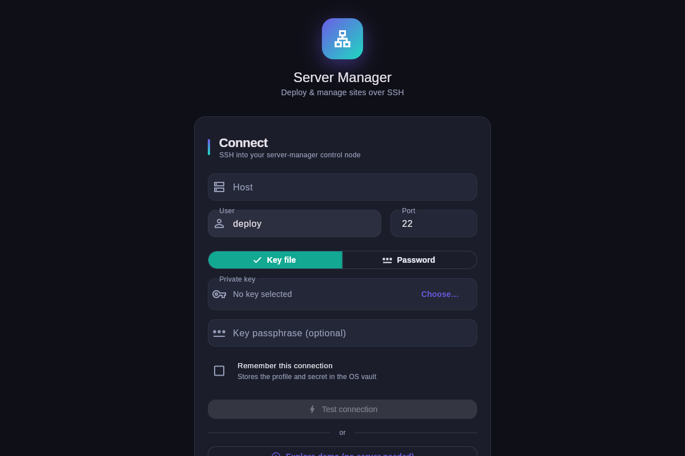
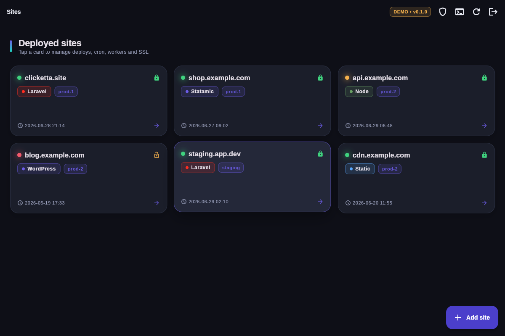
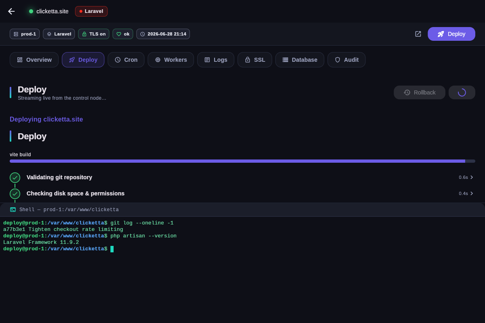
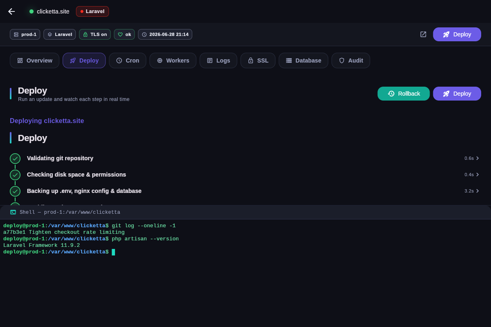
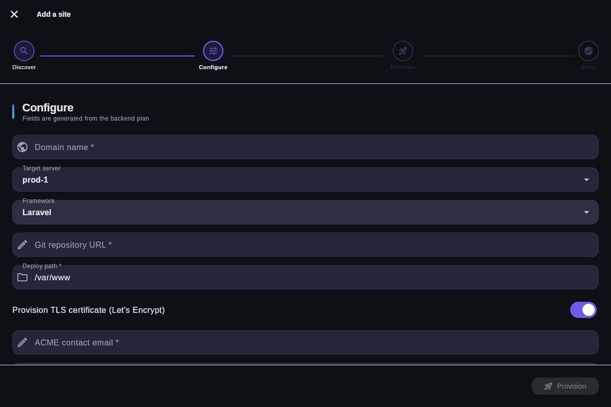
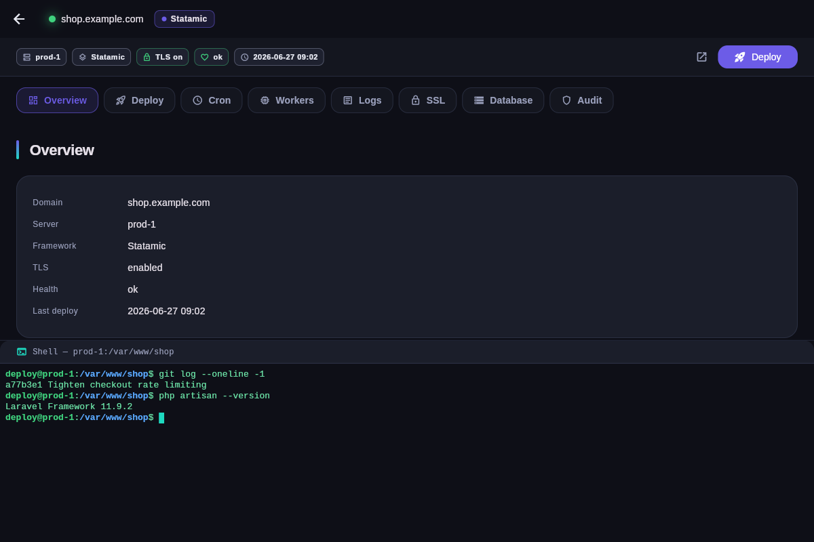
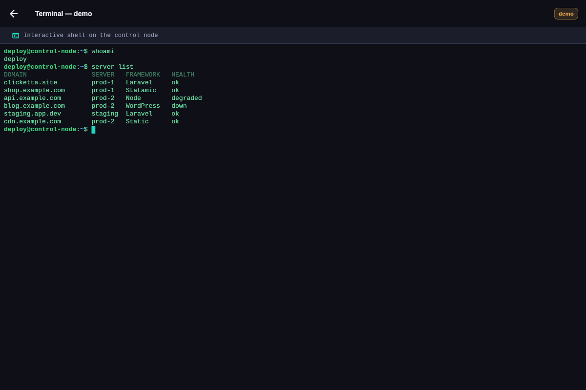
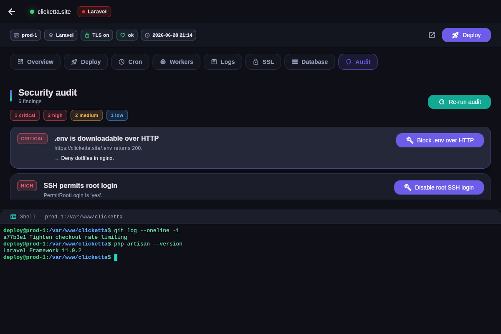
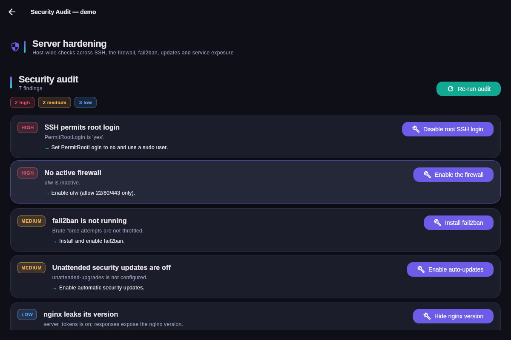

# Screenshots — server-manager desktop UI

Captured from the **native Linux desktop build** (`flutter build linux --release`)
running under a virtual X display, in demo mode (canned data, no SSH server
needed). The same Flutter codebase builds for Windows and macOS.

| Screen | Preview |
|--------|---------|
| **Connect** — guided onboarding: SSH host/user/port, key-file vs password, "Explore demo" |  |
| **Dashboard** — animated grid of site cards: health dot, framework chip, TLS badge, last deploy, "Add site" FAB |  |
| **Deploy (live)** — the showcase: real-time animated timeline; per-step spinner → check/cross, durations, a failure + retry, progress bar |  |
| **Deploy (complete)** — the full 12-step `update` flow finished |  |
| **Add site wizard** — animated stepper (Discover → Configure → Provision → Done); the form is generated from the backend's `--plan` field spec |  |
| **Site detail** — tabbed management (Overview · Deploy · Cron · Workers · Logs · SSL) |  |
| **Terminal** — interactive remote shell (xterm) on the control node; live SSH PTY via dartssh2, with an offline demo shell |  |
| **Security audit (per-site)** — findings grouped by severity with one-click fixes, in the site workspace |  |
| **Security audit (server-wide)** — host hardening reachable from the dashboard |  |

## How these were generated

```bash
cd app
flutter build linux --release
# launch the binary with SM_DEMO=1 and SM_ROUTE=<route> under Xvfb, grab with ImageMagick `import`
```

Demo mode and the initial screen are driven by environment variables the app
reads at startup (native) or query params (web):

- `SM_DEMO=1` — start connected to the canned `DemoCliService` (no SSH).
- `SM_ROUTE=/dashboard` — open directly on a given route.
- `SM_TAB=deploy` — open a specific site-detail tab.
- `SM_AUTODEPLOY=1` — auto-start a demo deploy so the live timeline animates.
